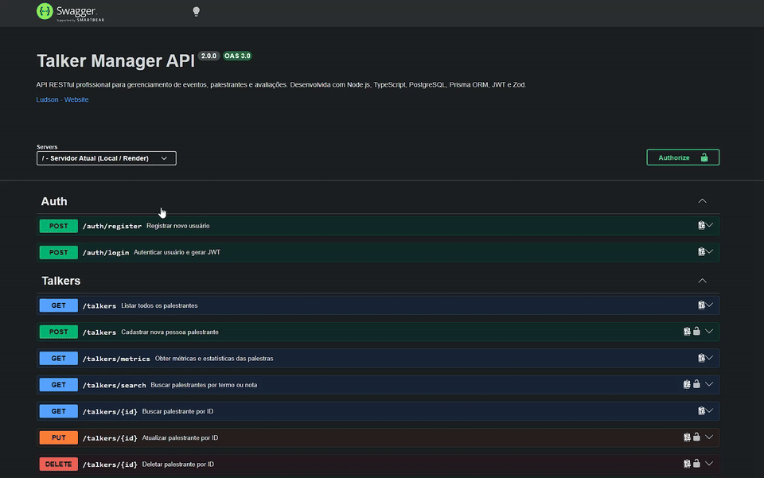
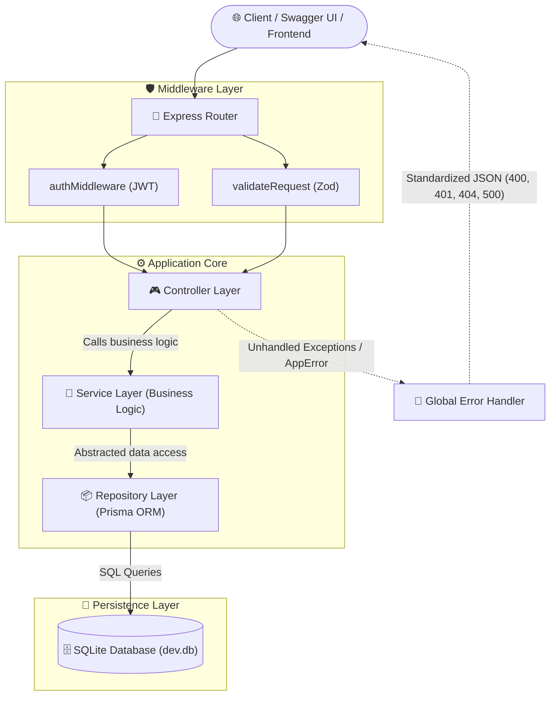

# Talker Manager API 🗣️

[](https://nodejs.org/)
[](https://www.typescriptlang.org/)
[](https://expressjs.com/)
[](https://www.prisma.io/)
[](https://www.sqlite.org/)
[](https://www.docker.com/)
[](https://swagger.io/)
[](https://zod.dev/)
[](https://jestjs.io/)
[](https://opensource.org/licenses/MIT)

> 🇺🇸 **English** | 🇧🇷 [**Versão em Português**](README.md)

A scalable and production-grade RESTful API for **conference, speaker, and talk management**. Built using layered architecture (**Layered / MSC with Repository Pattern**), declarative validation with **Zod**, secure authentication with **JWT + Bcrypt**, autonomous persistence using **Prisma ORM + SQLite**, and interactive documentation with **Swagger (OpenAPI 3.0)**.

## 📌 Quick Navigation

- [📝 About the Project](#-about-the-project)
- [🖼️ Preview](#️-preview)
- [🌐 Online Swagger Demo](#-online-swagger-demo)
- [⚡ API Endpoints](#-api-endpoints)
- [✨ Key Features](#-key-features)
- [🛠️ Technologies and Tools Used](#️-technologies-and-tools-used)
- [🏛️ Solution Architecture](#️-solution-architecture)
- [📁 Repository Structure](#-repository-structure)
- [💡 Technical Decisions](#-technical-decisions)
- [🚀 How to Run the Project](#-how-to-run-the-project)
- [📄 License](#-license)

## 📝 About the Project
**Talker Manager API** is a modern software solution designed for registering, organizing, and reviewing speakers at technical conferences and events. The project was engineered to showcase high standards in backend software engineering, adopting strict static typing with TypeScript, domain and infrastructure isolation, declarative input validation, and optimized Docker containerization ready for cloud deployments.

## 🖼️ Preview


## 🌐 Online Swagger Demo
Access the application running in production:
👉 **[Talker Manager API](https://project-talker-manager.onrender.com/api-docs/)**

*(The root path `/` automatically redirects to the interactive Swagger documentation)*

## ⚡ API Endpoints

### Authentication (`/auth`)
| Method | Route | Description | Authentication |
| :--- | :--- | :--- | :---: |
| `POST` | `/auth/register` | Registers a new user with encrypted password | None |
| `POST` | `/auth/login` | Authenticates user and returns JWT Bearer Token | None |

### Speakers and Talks (`/talkers`)
| Method | Route | Description | Authentication |
| :--- | :--- | :--- | :---: |
| `GET` | `/talkers` | Lists all registered speakers | None |
| `GET` | `/talkers/:id` | Retrieves speaker details by ID | None |
| `GET` | `/talkers/search?q=term&rate=5` | Searches speakers by name query or rating | Yes (Bearer) |
| `GET` | `/talkers/metrics` | Retrieves global talk metrics and averages | None |
| `POST` | `/talkers` | Registers a new speaker and their talk details | Yes (Bearer) |
| `PUT` | `/talkers/:id` | Updates a speaker profile and talk rating | Yes (Bearer) |
| `DELETE` | `/talkers/:id` | Deletes a speaker and associated talk records | Yes (Bearer) |

> 💡 *Note: Full backward compatibility is preserved for legacy `/talker` and `POST /login` routes.*

## ✨ Key Features
- **Secure Authentication & Authorization**: Industry-standard JWT issuance and password hashing with Bcrypt (10 salt rounds).
- **Full CRUD for Speakers**: Create, detailed read, update, and cascading deletion.
- **Dynamic Search & Filtering**: Multi-parameter search supporting text queries (`q`) and rating score filters (`rate`).
- **Real-time Analytics**: Live computation of average talk ratings and global speaker metrics.
- **Declarative Type-safe Validation**: Zod schemas preventing invalid payloads before reaching business services.
- **Centralized Error Handling**: Global Express middleware translating domain exceptions (`AppError`) and validation errors (`ZodError`).
- **Autonomous Database Seed**: Built-in seeding mechanism generating demo speakers and an admin user on bootstrap.

## 🛠️ Technologies and Tools Used

| Layer / Purpose | Technology | Description |
| :--- | :--- | :--- |
| **Core Language** | **TypeScript 5.9.3** | Strict static typing, generics, and compile-time code safety |
| **Runtime Environment** | **Node.js 20 LTS** | Modern, asynchronous, high-performance runtime |
| **Web Framework** | **Express 4.17.1** | Modular routing, middleware composition, and HTTP lifecycle |
| **Data Persistence** | **Prisma ORM 6.19.3** | Declarative type-safe ORM mapping and schema migrations |
| **Database** | **SQLite (Embedded)** | Self-contained SQL engine, eliminating external infrastructure dependencies |
| **Schema Validation** | **Zod 4.6.2** | Declarative runtime validation for payloads and query parameters |
| **Security & Encryption** | **JWT & BcryptJS** | Cryptographic token signing and salted password hashing |
| **Interactive Docs** | **Swagger UI / OpenAPI 3.0** | Live OpenAPI 3 specification and integrated browser test console |
| **Automated Testing** | **Jest 29 & Supertest 7** | Integration test suite covering endpoints and API contracts |
| **Containerization** | **Docker & Docker Compose** | Multi-stage build producing an ultra-lightweight Alpine production image |

## 🏛️ Solution Architecture
The application is structured following the **Layered Architecture (MSC with Repository Pattern)** principles, ensuring strict separation of concerns between HTTP handlers, business logic, and database access:



## 📁 Repository Structure
```text
.
├── prisma/
│   ├── schema.prisma           # Relational schema models (User, Talker, Talk)
│   ├── seed.js                 # Autonomous database seeder with demo data
│   └── seed.ts                 # TypeScript source file for database seeding
├── src/
│   ├── @types/                 # Global Express request type augmentations
│   ├── config/                 # Typed centralized environment configuration
│   ├── controllers/            # HTTP Controllers (AuthController, TalkerController)
│   ├── database/               # Prisma Client singleton provider
│   ├── docs/                   # Swagger OpenAPI 3.0 specification definition
│   ├── errors/                 # Custom domain AppError class
│   ├── middlewares/            # Middlewares for Auth, Zod validation, and Errors
│   ├── repositories/           # Database access layer (Repository Pattern)
│   ├── routes/                 # Modular decoupled Express routers
│   ├── schemas/                # Declarative Zod validation schemas
│   ├── services/               # Core business logic services
│   ├── tests/                  # Automated integration tests
│   ├── app.ts                  # Express application setup, CORS, and Swagger mount
│   └── server.ts               # HTTP server entrypoint and bootstrap
├── Dockerfile                  # Multi-stage production container build
├── docker-compose.yml          # Local container orchestration
├── jest.config.js              # Jest test runner configuration
├── package.json                # Project dependencies and script runner
└── tsconfig.json               # TypeScript compiler configuration
```

## 💡 Technical Decisions
1. **Self-Contained Database (SQLite with Prisma)**: Similar to using H2 in the Java ecosystem, SQLite eliminates external database server overhead for portfolio demonstrations, ensuring perpetual free hosting without expiry.
2. **Multi-Stage Docker Optimization**: The build stage generates Prisma Client artifacts and compiles TypeScript to `dist/`, leaving the final `node:20-alpine` runner image small, secure, and devoid of build tools.
3. **Repository Pattern on Top of Prisma**: Services communicate only with Repository classes. This abstraction allows swapping ORMs or database engines in the future without changing core domain rules.
4. **Centralized Error Handling with AppError**: Leveraging `express-async-errors`, unexpected or handled domain exceptions bubble up to `errorMiddleware`, producing uniform JSON error formats without cluttering controllers with repetitive `try/catch` blocks.

## 🚀 How to Run the Project

### Prerequisites
- **Node.js**: Version 20 or higher
- **Git** installed

### 1. Clone the repository
```bash
git clone git@github.com:Ludson96/project-talker-manager.git
cd project-talker-manager
```

### 2. Install dependencies
```bash
npm install
```

### 3. Setup environment variables
Create your `.env` file from the provided template:
```bash
cp .env.example .env
```

### 4. Initialize Database and Seed Demo Data
```bash
npx prisma db push
npm run prisma:seed
```

### 5. Start the development server
```bash
npm run dev
```
The server will be available at `http://localhost:3000`.

### 6. Run via Docker (Optional)
```bash
docker build -t talker-manager-api .
docker run -p 3000:3000 talker-manager-api
```

### 7. Run Automated Tests
```bash
npm test
```

## 📄 License
This project is licensed under the [MIT License](https://opensource.org/licenses/MIT).

<div align="center">
  Developed by <strong>Ludson Pereira dos Santos</strong> 🚀<br />
  <a href="https://www.linkedin.com/in/ludson96/">LinkedIn</a> • <a href="https://github.com/ludson96">GitHub</a> • <a href="mailto:ludson_ps27@hotmail.com">Email</a>
</div>
